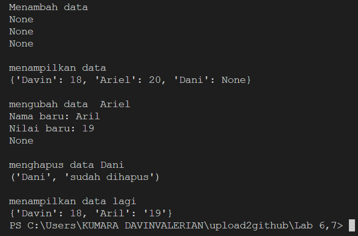

# Penjelasan Praktikum Fungsi def
Pada praktikum ini akan menggunakan fungsi (def). Fungsi pada python adalah kumpulan perintah atau baris kode yang dikelompokkan menjadi satu kesatuan untuk kemudian bisa dipanggil atau digunakan berkali-kali. 
Dengan rumus:
```
def <nama_fungsi>(parameters):
  statements atau perintah
```
## Output
Pada script praktikum def, cetak nama dan nilai terserah



